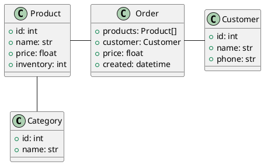

# Project: food store

For the rest of the term, we are going to work on a project. The purpose is to
build a management system for a small "shop" selling goods. To make the platform
easier to manage, we are going to use a database for persistence. We will use
SQLite. It is a very lightweight database engine that does not require any
software dependencies in Python. It has decent performance and is compatible
with SQL queries.

## Class diagram

This is the structure of the data we want to deal with.



## Setup Project Directory using UV

See: 
[Create your first Python project](https://pydevtools.com/handbook/tutorial/create-your-first-python-project/)

### Steps
1. Creation ` uv init --app .\store`
1. customize `pyproject.toml` to add testing directory, see "Configure Tests
   Directory" below
1. Add directory for tests `tests`
1. Add `pytest` as dev tool. `uv add --dev pytest pytest-cov`
1. Configure tests in vscode to use `pytest` and look in `tests` directory
1. add `sqlalchemy` dependency to project. `uv add sqlalchemy`

### Configure Tests Directory

1. Configure tests so that test directory is in python path: update
   `pyproject.toml`

   ```toml
    [tool.pytest.ini_options]
    minversion = "8.1"
    testpaths = ["tests"]
    pythonpath = ["."]
   ```

#### Pytest Configuration References

   1. [Pytest Settings](https://docs.pytest.org/en/stable/reference/reference.html)
   2. [Pytest Configuration](https://docs.pytest.org/en/stable/reference/customize.html)

#### Configure Git Ignore

````
__pycache__
.venv
.pytest_cache
````

#### SQLite VScode Extensions

1. (SQLite3 Editor)(https://marketplace.visualstudio.com/items?itemName=yy0931.vscode-sqlite3-editor) - double click database file

## Setup SQLAlchemy

### Installation

SQLAlchemy is a separate module that you need to install. Do it with
`uv add sqlalchemy`.

### Database configuration

Create a new file (for example: `database.py`), and use the following contents -
make sure to adjust the values as required.

```python
from sqlalchemy import create_engine
from sqlalchemy.orm import sessionmaker

engine = create_engine("sqlite:///I_DID_NOT_COPY_PASTE_DID_I.db", echo=True)
Session = sessionmaker(bind=engine)
```

In the example above,

- `sqlite://` is the database engine identifier (= SQLite)
- `/I_DID_NOT_COPY_PASTE_DID_I.db` is the path to the database file, taken from
  the current project folder.
  - `/` = root of the project folder
  - the rest = the filename for your database. Change it!

In order to work, SQL Alchemy needs two things:

- a database engine (actually talking to the database, making requests and
  getting results back)
- a session system (databases are transactional, and all transactions happen in
  a session)

In the example above:

- `engine` is the database engine
- `Session` is a class that we can use to interact with the database using
  queries. This class is bound to the `engine`, which connects to our SQLite
  database.

## Define your database tables with classes

Create a file (for example `models.py`). Create a new Python class `Base`, and
make it inherit the `DeclarativeBase` class from SQL Alchemy:

```python
from sqlalchemy.orm import DeclarativeBase

class Base(DeclarativeBase):
    pass
```

You can now create classes to represent the entities described in the class
diagram. For example, for the `Product` class:

```python
from sqlalchemy import String, DECIMAL, Integer
from sqlalchemy.orm import mapped_column

class Product(Base):
    __tablename__ = "product"

    id = mapped_column(Integer, primary_key=True)
    name = mapped_column(String)
    price = mapped_column(DECIMAL(10, 2))
    inventory = mapped_column(Integer, default=0)
    category = mapped_column(String)
```

__Note__: 
The database fields are defined as _class variables_. SQL Alchemy will
create a constructor and manage data validation "automatically" 

For each model:

- Make sure it inherits from `Base`!
- It must have a class attribute `__tablename__` (the name of the SQL table in
  the database).
- The column types must use the types provided by SQL Alchemy.
- Use `mapped_column` to declare a column. You may use type hints for
  auto-discovery of types.
- All fields are declared as class variables, but will be synced to/from the
  database for each instance.

Write the `Product` and `Customer` classes. It is a good idea to implement
`__str__` on your classes - or even `__repr__` for easier debugging in the
console.

## Create your database tables

You should now be able to create your database and tables. SQL Alchemy can do
that - the `Base` class knows about all the models that inherit from it.

Run a **Python interactive shell** using `uv run python`. Import both your `Base` class and your
database `engine`. Then create the tables:

```python
from database import engine
from models import Base

Base.metadata.create_all(engine)
```

> You should now have a `.db` file in your project folder. You can open it with
> VS Code (for instance with the _SQLite Viewer_ extension). The database is
> empty at that stage!

Note: you can also use `Base.metadata.drop_all(engine)` to drop all tables and
their data.

## Create and save a new database record

It is now easy to save objects to the database: create an instance, add it to
the session, and commit.

```python
from database import Session
from models import Product

product = Product(name="eggs", price=12.34, available=100)
session = Session()
session.add(product)
session.commit()
```

> You only need to commit once (you can add several objects in one commit).

## Import data into the database

Create a new Python file (for example: `main.py`).

Create functions to:

- create all database tables
- drop all database tables

Make sure you can call each function using a CLI argument. For example:
`python main.py create` = creates tables; `python main.py drop` = drops tables.

### Use the CSV files to import data

Copy the [`products.csv`](/exercises/project/products.csv) into your project folder. Then, in your code, add a new
function that:

- reads from the CSV file
- creates objects from the CSV records
- adds the records to the database

Make sure you can call that function using a CLI argument. For example:
`python main.py import`.

__Note__: 
if you use a `DictReader` for CSV, you may be able to use `**` unpacking if your model definition matches the CSV columns.**

## Query the database

You can now use SQL Alchemy to run queries on your database. The good thing is -
you don't have to know the SQL syntax. SQL Alchemy builds the queries for you.
There are at least 2, typically 3 steps to making a database query:

- create the statement (usually with `select`)
- execute the query (`session.execute`)
- extract the results
  - use `.scalars()` if you expect multiple rows
  - use `.scalar()` if you expect a single row

### Get all product objects from the database

```python
from sqlalchemy import select

session = Session()
statement = select(Product)
results = session.execute(statement)
for prod in results.scalars():
    print(prod)
```

### Get all product objects that are out of stock

```python
statement = select(Product).where(Product.inventory < 1)
results = session.execute(statement)
for prod in results.scalars():
    print(prod.name)
```

## Improve your database schema

Each product belongs to a category. This is a `one-to-many` relationship (one
category has multiple products).

Make changes to your `models.py` so that there are now two tables: `products`
and `categories`. Link the two tables with a foreign key, and remove the
"category" string field from `Product`.

```python
class Product(Base):
    # [...] existing attributes
    category_id = mapped_column(Integer, ForeignKey("categories.id"))
    category = relationship("Category", back_populates="products")

class Category(Base):
    __tablename__ = "categories"

    id = mapped_column(Integer, primary_key=True)
    name = mapped_column(String)
    products = relationship("Product", back_populates="category")
```

- `category_id` is the foreign key to categories on products.
- Each product has a single category.
- The foreign key is built on the primary key of the `categories` table.
- Pay attention to the `relationship` field! This allows you to use SQL Alchemy
  magic to traverse relationships.

```python
# prod is a Product object coming from the database
# my_cat is a Category object coming from the database
prod.category # this is the object Category from the database (with ID, etc.)
my_cat.products # this is a list of Book instances that have the category `my_cat`
```

Update your code to import products and categories in two separate tables.

### Make sure you don't have duplicate categories!

Before creating a new category, make sure it does not already exist in the
database.

```python
possible_category = session.execute(select(Category).where(Category.name == category)).scalar()

if not possible_category:
    category_obj = Category(name=category)
    session.add(category_obj)
else:
    category_obj = possible_category

# Only use this if your models match the CSV headers
prod = Product(name=row["name"], price=float(row["price"]), [...], category=category_obj)
session.add(prod)
session.commit()
```

## Import "user" data

Look at the [`customers.csv`](/exercises/project/customers.csv) file. It contains information about the customers of
the store. Each customer has:

- a name
- a phone number

Create the `Customer` model and write the code to import all data in the CSV
file to Python objects.

## Clean up and organize your code

You can now complete the lab by separating the logic of your program into Python
modules. You should have at least 3:

- `db.py` - for SQL Alchemy initialization and engine setup
  - `engine` and `Session`
- `models.py` - your Python classes to be used with SQL Alchemy
  - `Base`, `Product` and `Customer`
- `main.py` (or the name of your choice) - read from the CSV and import into the
  database - you should create functions to organize your code!
  - function to drop the tables
  - function to recreate the tables
  - function to import data from the CSV file
  - `if __name__ == "__main__"` block to switch between functions
  - use `sys.argv` if necessary

## Completion

The lab is complete when:

- all your code is clean, uses functions / classes as required and is organized
  into separate files / modules.
- the database contains all the products and categories listed in the CSV file.
- there are no duplicates in the database.
- you can easily drop / create the tables, as well as import all the data from
  the CSV files.
- you have a basic understanding of how to make SQL queries using SQL Alchemy.

Example of queries:

- find all products that are out of stock (`inventory == 0`) or almost
  (`inventory <= [choose a number]`)
- find all customers whose name contain a string (for example `ma` or `phil`)
- find all products that belong to the category with name `dairy`
  - try it by querying from the `Category` class: select the category with a
    given name, and use `.products` on it
  - try it by querying from the `Product` class
  - you can use the special statement `has` on the foreign key:
    `select(Product).where(Product.category.has(Category.name == "example"))`
- find all `dairy` products that are out of stock
